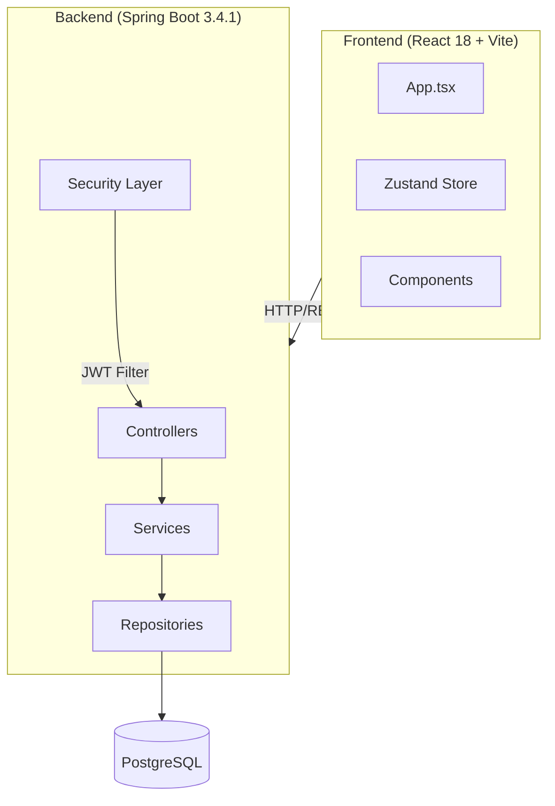
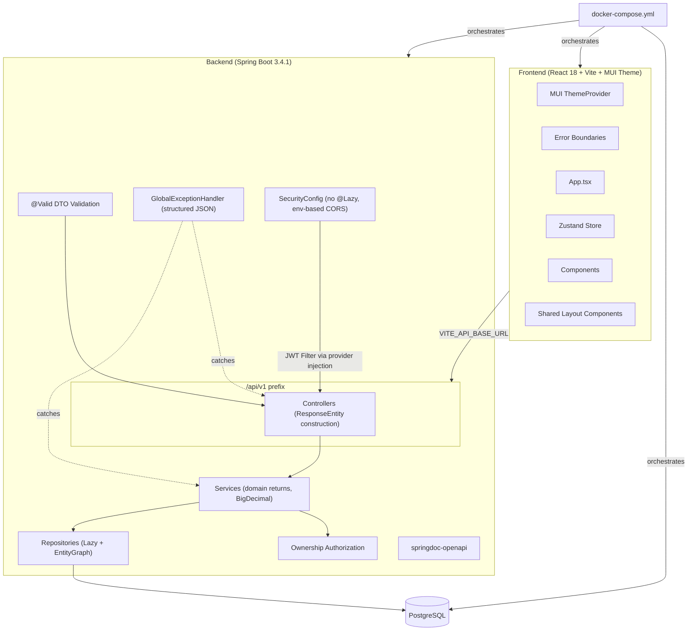
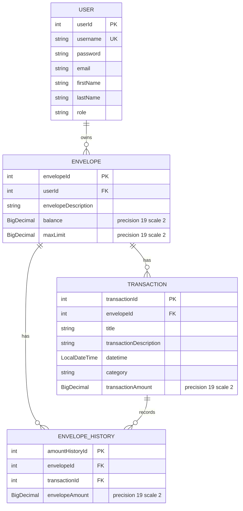

# Design Document: Project Improvement

## Overview

This design covers a comprehensive improvement of the Gooder Budget envelope budgeting application — a full-stack system with a Spring Boot 3.4.1 / Java 17 backend and a React 18 / TypeScript / Vite frontend. The improvements are grouped into four pillars:

1. **Security & Configuration** (Requirements 1–4): Externalize secrets, restrict CORS, validate input, enforce ownership authorization.
2. **Backend Architecture & Data Integrity** (Requirements 5–11): Migrate to BigDecimal for money, decouple services from HTTP, fix lazy fetching / N+1, standardize exceptions, resolve circular dependency, add pagination, fix REST design.
3. **Frontend Resilience & Styling** (Requirements 12–13, 17): Error boundaries, loading/error states, unified styling with MUI ThemeProvider.
4. **DevOps, Testing & Documentation** (Requirements 14–16, 18): Expand test coverage with JaCoCo, Docker Compose orchestration, OpenAPI docs, project README.

The changes are incremental refactors to the existing codebase — no framework migrations or database replacements.

## Architecture

### Current Architecture



### Target Architecture



Key architectural changes:

- Services return domain objects/DTOs, not `ResponseEntity` — controllers own HTTP concerns
- All monetary fields use `BigDecimal` with scale 2 throughout entities, DTOs, and service logic
- JPA associations switch from `FetchType.EAGER` to `FetchType.LAZY` with `@EntityGraph` / `JOIN FETCH` where needed
- SecurityConfig eliminates `@Lazy` by extracting `AuthenticationManager` bean creation to a separate `@Configuration` class
- All endpoints move under `/api/v1` prefix
- Frontend wraps routes in `ErrorBoundary`, adds `ThemeProvider`, consolidates CSS variables

## Components and Interfaces

### Requirement 1 & 2: Externalize Secrets and Restrict CORS

**Backend `application.properties`** — replace hardcoded values with environment variable placeholders:

```properties
spring.datasource.url=${DB_URL}
spring.datasource.username=${DB_USERNAME}
spring.datasource.password=${DB_PASSWORD}
jwt.private-key=${JWT_PRIVATE_KEY}
cors.allowed-origins=${CORS_ALLOWED_ORIGINS}
```

**SecurityConfig CORS** — read `cors.allowed-origins` as a comma-separated list and configure explicit origins:

```java
@Value("${cors.allowed-origins}")
private String[] allowedOrigins;
```

Replace `allowedOriginPatterns("*")` with `allowedOrigins(allowedOrigins)`.

**Frontend `backendHost.tsx`** — replace hardcoded IP:

```typescript
const backendHost: string =
  import.meta.env.VITE_API_BASE_URL || "http://localhost:8080";
```

Remove the hardcoded `axios.defaults.baseURL` from `App.tsx`.

### Requirement 3: Validate Incoming Request Data

Add `spring-boot-starter-validation` dependency to `pom.xml`.

Convert DTOs to use Jakarta Validation annotations:

```java
// EnvelopeDTO
public record EnvelopeDTO(
    @NotNull Integer userId,
    @NotBlank @Size(max = 255) String envelopeDescription,
    @NotNull @DecimalMin("0") BigDecimal balance,
    @NotNull @DecimalMin("0") BigDecimal maxLimit
) {}

// TransferFundDTO
public record TransferFundDTO(
    @NotNull Integer fromId,
    @NotNull Integer toId,
    @NotBlank String transactionTitle,
    String transactionDescription,
    @NotNull @DecimalMin(value = "0", inclusive = false) BigDecimal amount
) {}

// IncomingLogin
public record IncomingLogin(
    @NotBlank String username,
    @NotBlank String password
) {}
```

Add `@Valid` to all controller method parameters. Add `MethodArgumentNotValidException` handler to `GlobalExceptionHandler` returning structured field-level errors.

### Requirement 4: Enforce Resource Ownership Authorization

Add an `OwnershipService` or inline ownership checks in `EnvelopeService`:

```java
private void verifyOwnership(Envelope envelope, String authenticatedUsername) {
    if (!envelope.getUser().getUsername().equals(authenticatedUsername)) {
        throw new AccessDeniedException("Access denied");
    }
}
```

The authenticated user's username is obtained from `SecurityContextHolder`. Manager role (`ROLE_MANAGER`) bypasses ownership checks. Controllers pass the authenticated principal to service methods.

### Requirement 5: BigDecimal Migration

**Entity changes:**

- `Envelope.balance` and `Envelope.maxLimit`: `double` → `BigDecimal` with `@Column(precision = 19, scale = 2)`
- `Transaction.transactionAmount`: `double` → `BigDecimal` with `@Column(precision = 19, scale = 2)`
- `EnvelopeHistory.envelopeAmount`: `double` → `BigDecimal` with `@Column(precision = 19, scale = 2)`

**DTO changes:**

- `EnvelopeDTO.balance`, `EnvelopeDTO.maxLimit` → `BigDecimal`
- `TransferFundDTO.amount` → `BigDecimal`
- `TransactionDTO.transactionAmount` → `BigDecimal`
- `EnvelopeHistoryDTO.envelopeAmount` → `BigDecimal`

**Service arithmetic:**
Replace all `+`, `-`, `<`, `>` operators on monetary values with `BigDecimal.add()`, `BigDecimal.subtract()`, `BigDecimal.compareTo()`. Use `RoundingMode.HALF_UP` for any division.

### Requirement 6: Decouple Services from HTTP Layer

Refactor all service methods to return domain objects or DTOs:

| Current Signature                                       | New Signature                                     |
| ------------------------------------------------------- | ------------------------------------------------- |
| `ResponseEntity<?> createEnvelope(EnvelopeDTO)`         | `Envelope createEnvelope(EnvelopeDTO)`            |
| `ResponseEntity<?> getEnvelopeById(Integer)`            | `Envelope getEnvelopeById(Integer)`               |
| `ResponseEntity<?> getAllEnvelopes()`                   | `List<Envelope> getAllEnvelopes()`                |
| `ResponseEntity<?> deleteEnvelope(Integer)`             | `void deleteEnvelope(Integer)`                    |
| `ResponseEntity<?> transferEnvelope(TransferFundDTO)`   | `void transferEnvelope(TransferFundDTO)`          |
| `ResponseEntity<?> allocateMoney(Integer, Transaction)` | `Transaction allocateMoney(Integer, Transaction)` |
| `ResponseEntity<?> spendMoney(Integer, Transaction)`    | `Transaction spendMoney(Integer, Transaction)`    |

Controllers construct `ResponseEntity` with typed generics (e.g., `ResponseEntity<EnvelopeDTO>`).

### Requirement 7: Lazy Fetching and N+1 Resolution

Change all `FetchType.EAGER` to `FetchType.LAZY` on:

- `User.envelopes`
- `Envelope.user`, `Envelope.transactions`, `Envelope.envelopeHistories`
- `Transaction.envelope`, `Transaction.envelopeHistories`
- `EnvelopeHistory.envelope`, `EnvelopeHistory.transaction`

Add `@EntityGraph` or `@Query` with `JOIN FETCH` to repository methods that need associated data:

```java
// EnvelopeRepository
@EntityGraph(attributePaths = {"user"})
Optional<Envelope> findById(Integer id);

@EntityGraph(attributePaths = {"user"})
List<Envelope> findByUser_UserId(Integer userId);
```

### Requirement 8: Standardize Exception Handling

Replace all `throw new RuntimeException(...)` in services with `throw new BusinessException(code, message)`.

Expand `GlobalExceptionHandler`:

```java
@ExceptionHandler(BusinessException.class)
public ResponseEntity<Map<String, Object>> handleBusiness(BusinessException e) {
    return ResponseEntity.status(HttpStatus.BAD_REQUEST)
        .body(Map.of("code", e.getCode(), "message", e.getMessage()));
}

@ExceptionHandler(MethodArgumentNotValidException.class)
public ResponseEntity<Map<String, Object>> handleValidation(MethodArgumentNotValidException e) {
    Map<String, String> fieldErrors = new HashMap<>();
    e.getBindingResult().getFieldErrors()
        .forEach(err -> fieldErrors.put(err.getField(), err.getDefaultMessage()));
    return ResponseEntity.badRequest().body(Map.of("errors", fieldErrors));
}

@ExceptionHandler(AccessDeniedException.class)
public ResponseEntity<Map<String, Object>> handleAccessDenied(AccessDeniedException e) {
    return ResponseEntity.status(HttpStatus.FORBIDDEN)
        .body(Map.of("error", "Access denied", "message", e.getMessage()));
}

@ExceptionHandler(UsernameNotFoundException.class)
public ResponseEntity<Map<String, Object>> handleNotFound(UsernameNotFoundException e) {
    return ResponseEntity.status(HttpStatus.UNAUTHORIZED)
        .body(Map.of("error", "Authentication failed", "message", e.getMessage()));
}

@ExceptionHandler(Exception.class)
public ResponseEntity<Map<String, Object>> handleAll(Exception e) {
    logger.error("Unhandled exception", e);
    return ResponseEntity.status(HttpStatus.INTERNAL_SERVER_ERROR)
        .body(Map.of("error", "Internal server error"));
}
```

### Requirement 9: Resolve Circular Dependency

The circular dependency exists because:

- `SecurityConfig` needs `JWTAuthFilter`
- `JWTAuthFilter` needs `AuthenticationManager`
- `AuthenticationManager` is defined as a bean in `SecurityConfig`

**Solution:** Extract `AuthenticationManager` bean into a separate `@Configuration` class (`AuthManagerConfig`), or have `JWTAuthFilter` use `@Lazy` removal by accepting `AuthenticationManager` via a setter / `ObjectProvider<AuthenticationManager>` instead of constructor injection.

Preferred approach — use `ObjectProvider`:

```java
@Component
public class JWTAuthFilter extends OncePerRequestFilter {
    private final ObjectProvider<AuthenticationManager> authManagerProvider;

    public JWTAuthFilter(ObjectProvider<AuthenticationManager> authManagerProvider) {
        this.authManagerProvider = authManagerProvider;
    }

    @Override
    protected void doFilterInternal(...) {
        AuthenticationManager authManager = authManagerProvider.getObject();
        // ... rest of filter logic
    }
}
```

Remove `@Lazy` from `SecurityConfig` constructor.

### Requirement 10: Pagination

Add `Pageable` parameter to service and repository methods. Return `Page<T>` wrapped in a standard paginated response DTO:

```java
public record PaginatedResponse<T>(
    List<T> content,
    long totalElements,
    int totalPages,
    int currentPage,
    int pageSize
) {}
```

Controller endpoints accept `@RequestParam(defaultValue = "0") int page` and `@RequestParam(defaultValue = "20") int size`.

Repositories extend `JpaRepository` which already supports `Pageable`.

### Requirement 11: REST API Design Fixes

- `UserController @DeleteMapping` — change from `@RequestBody String username` to `@DeleteMapping("/{username}") @PathVariable String username`
- `EnvelopeController` — change `/envelopes/user/{userId}` to `/users/{userId}/envelopes` or use query param `/envelopes?userId={userId}`
- Add `/api/v1` prefix via `server.servlet.context-path=/api/v1` in `application.properties` or a `@RequestMapping("/api/v1")` base on controllers
- Frontend — remove duplicate `/transactions` route in `App.tsx`

### Requirement 12: Frontend Error Boundaries

Create an `ErrorBoundary` class component (React error boundaries require class components):

```tsx
class ErrorBoundary extends React.Component<Props, State> {
  state = { hasError: false };
  static getDerivedStateFromError() {
    return { hasError: true };
  }
  componentDidCatch(error: Error, info: React.ErrorInfo) {
    console.error(error, info);
  }
  render() {
    if (this.state.hasError)
      return <FallbackUI onRetry={() => this.setState({ hasError: false })} />;
    return this.props.children;
  }
}
```

Wrap each `<Route>` element in `App.tsx` with `<ErrorBoundary>`.

### Requirement 13: Frontend Loading and Error States

Add `isLoading` and `error` state to data-fetching components (e.g., `EnvelopeList`, `DetailedEnvelope`, `AllTransactions`). Display MUI `CircularProgress` during loading and an `Alert` with retry button on error.

### Requirement 14: Expand Backend Test Coverage

- Add `spring-boot-starter-test` MockMvc integration tests for all controllers
- Add security tests: unauthenticated → 401, wrong-user access → 403
- Add unit tests for `EnvelopeService.transferEnvelope`, `allocateMoney`, `spendMoney` covering success, insufficient funds, exceeds-limit
- Clean up unused imports/variables in existing test files
- Add JaCoCo plugin to `pom.xml`

### Requirement 15: Docker Compose

Create `docker-compose.yml` at project root with three services:

- `db`: PostgreSQL 15 with named volume
- `backend`: Multi-stage Dockerfile (Maven build → JDK 17 runtime), environment variables passed in
- `frontend`: Multi-stage Dockerfile (Node build → Nginx), serves static assets

Update `backend/Dockerfile` to multi-stage build.

### Requirement 16: OpenAPI Documentation

Add `springdoc-openapi-starter-webmvc-ui` dependency. Configure paths in `application.properties`:

```properties
springdoc.api-docs.path=/api/v1/api-docs
springdoc.swagger-ui.path=/api/v1/swagger-ui
```

Permit unauthenticated access to these paths in `SecurityConfig`.

### Requirement 17: Unify Frontend Styling

1. Create `_variables.scss` with all CSS custom properties (colors, spacing, border-radius, shadows)
2. Remove `:root` blocks from Login.scss, Register.scss, Personalize.scss, DetailedEnvelope.scss, Navbar.scss
3. Convert `AddMoney.css` and `CreateEnvelope.css` to `.scss`
4. Replace `button1`, `button2`, `button3`, `envButton1` with a single `.btn-primary` class or MUI theme button override
5. Create MUI `ThemeProvider` in `main.tsx` with primary (green) and secondary (purple) palette
6. Extract shared two-column layout mixin or component used by Login, Register, Personalize, CreateEnvelope
7. Add `:focus-visible` outlines to all interactive elements

### Requirement 18: Project README

Create `README.md` at project root with:

- Project description and tech stack
- Prerequisites (Java 17, Node 18+, Docker)
- Local setup via `docker-compose up`
- Running tests (`mvn verify`, `npm run lint`)
- Architecture diagram (Mermaid or text)

## Data Models

### Entity Relationship Diagram



### Key Data Model Changes

| Field                            | Current Type | New Type     | Column Annotation                    |
| -------------------------------- | ------------ | ------------ | ------------------------------------ |
| `Envelope.balance`               | `double`     | `BigDecimal` | `@Column(precision = 19, scale = 2)` |
| `Envelope.maxLimit`              | `double`     | `BigDecimal` | `@Column(precision = 19, scale = 2)` |
| `Transaction.transactionAmount`  | `double`     | `BigDecimal` | `@Column(precision = 19, scale = 2)` |
| `EnvelopeHistory.envelopeAmount` | `double`     | `BigDecimal` | `@Column(precision = 19, scale = 2)` |

All JPA associations change from `FetchType.EAGER` to `FetchType.LAZY`.

### DTO Changes

| DTO                  | Field                 | Current Type | New Type     |
| -------------------- | --------------------- | ------------ | ------------ |
| `EnvelopeDTO`        | `balance`, `maxLimit` | `Double`     | `BigDecimal` |
| `TransferFundDTO`    | `amount`              | `Double`     | `BigDecimal` |
| `TransactionDTO`     | `transactionAmount`   | `double`     | `BigDecimal` |
| `EnvelopeHistoryDTO` | `envelopeAmount`      | `double`     | `BigDecimal` |

### Paginated Response Model

```java
public record PaginatedResponse<T>(
    List<T> content,
    long totalElements,
    int totalPages,
    int currentPage,
    int pageSize
) {
    public static <T> PaginatedResponse<T> from(Page<T> page) {
        return new PaginatedResponse<>(
            page.getContent(),
            page.getTotalElements(),
            page.getTotalPages(),
            page.getNumber(),
            page.getSize()
        );
    }
}
```

### Structured Error Response Model

```java
public record ErrorResponse(
    int code,
    String message,
    Map<String, String> fieldErrors
) {}
```

## Correctness Properties

_A property is a characteristic or behavior that should hold true across all valid executions of a system — essentially, a formal statement about what the system should do. Properties serve as the bridge between human-readable specifications and machine-verifiable correctness guarantees._

### Property 1: CORS Origin Enforcement

_For any_ HTTP origin string, a CORS preflight request to the backend SHALL be accepted with credentials if and only if the origin is present in the configured `CORS_ALLOWED_ORIGINS` list. Origins not in the list SHALL receive a rejected CORS response.

**Validates: Requirements 2.2, 2.3**

### Property 2: EnvelopeDTO Validation Rejects Invalid Input

_For any_ EnvelopeDTO where `envelopeDescription` is blank or exceeds 255 characters, or where `balance` or `maxLimit` is null or negative, submitting the DTO to a `@Valid`-annotated controller endpoint SHALL result in a validation failure (HTTP 400).

**Validates: Requirements 3.2, 3.3**

### Property 3: TransferFundDTO Validation Rejects Invalid Input

_For any_ TransferFundDTO where `fromId` or `toId` is null, or `amount` is zero or negative, or `transactionTitle` is blank, submitting the DTO SHALL result in a validation failure (HTTP 400).

**Validates: Requirements 3.4**

### Property 4: IncomingLogin Validation Rejects Blank Credentials

_For any_ IncomingLogin where `username` or `password` is blank (including all-whitespace strings), submitting the DTO SHALL result in a validation failure (HTTP 400).

**Validates: Requirements 3.5**

### Property 5: User Registration Validation Rejects Invalid Payloads

_For any_ User registration payload where any of `username`, `password`, `email`, `firstName`, or `lastName` is blank, or `email` does not match a valid email pattern, or `password` is shorter than 8 characters, the registration request SHALL be rejected with a validation error.

**Validates: Requirements 3.6**

### Property 6: Validation Error Response Structure

_For any_ request that fails Jakarta Bean Validation (`@Valid`), the response SHALL be HTTP 400 and the JSON body SHALL contain a map of field names to error messages for every field that failed validation.

**Validates: Requirements 3.7, 8.6**

### Property 7: Resource Ownership Enforcement

_For any_ authenticated user with `ROLE_EMPLOYEE` and _for any_ envelope or transaction owned by a different user, attempting to read, delete, allocate, spend, or transfer involving that resource SHALL result in an HTTP 403 Forbidden response, and the resource SHALL remain unmodified.

**Validates: Requirements 4.1, 4.2, 4.3, 4.4, 4.5**

### Property 8: Manager Role Bypasses Ownership Checks

_For any_ authenticated user with `ROLE_MANAGER` and _for any_ envelope or transaction in the system (regardless of owner), the manager SHALL be granted access to read and operate on that resource.

**Validates: Requirements 4.6**

### Property 9: BigDecimal Scale Invariant

_For any_ Envelope, Transaction, or EnvelopeHistory entity persisted to the database, all monetary fields (`balance`, `maxLimit`, `transactionAmount`, `envelopeAmount`) SHALL have a BigDecimal scale of exactly 2.

**Validates: Requirements 5.1, 5.2, 5.3**

### Property 10: Balance-Transaction Sum Invariant

_For any_ Envelope with an initial balance of `B₀` and a sequence of `n` transactions (allocations, spends, transfers), the current envelope balance SHALL equal `B₀ + Σ(transactionAmounts)` where allocations are positive and spends are negative. Equivalently, `currentBalance - initialBalance == sum(allTransactionAmounts)`.

**Validates: Requirements 5.6**

### Property 11: BusinessException Structured Response

_For any_ BusinessException thrown by a service method, the GlobalExceptionHandler SHALL return an HTTP response with the appropriate status code and a JSON body containing both the `code` and `message` fields from the exception.

**Validates: Requirements 8.3**

### Property 12: Pagination Metadata Correctness

_For any_ list endpoint (envelopes, transactions, envelope history) called with `page` and `size` parameters, the response SHALL contain `totalElements`, `totalPages`, `currentPage`, and `pageSize` fields where: `currentPage == page`, `pageSize == size`, `totalPages == ceil(totalElements / size)`, and `content.length <= size`.

**Validates: Requirements 10.1, 10.2, 10.3, 10.4**

### Property 13: Unauthenticated Access Returns 401

_For any_ protected endpoint (any endpoint other than login, register, OpenAPI docs, and Swagger UI), a request without a valid JWT token SHALL receive an HTTP 401 Unauthorized response.

**Validates: Requirements 14.2**

## Error Handling

### Backend Error Handling Strategy

All errors flow through the `GlobalExceptionHandler` (`@RestControllerAdvice`). The handler maps exception types to HTTP status codes and structured JSON responses:

| Exception Type                    | HTTP Status     | Response Body                                                 |
| --------------------------------- | --------------- | ------------------------------------------------------------- |
| `BusinessException`               | 400 (or custom) | `{ "code": <int>, "message": "<string>" }`                    |
| `MethodArgumentNotValidException` | 400             | `{ "errors": { "<field>": "<message>", ... } }`               |
| `IllegalArgumentException`        | 400             | `{ "message": "<string>" }`                                   |
| `UsernameNotFoundException`       | 401             | `{ "error": "Authentication failed", "message": "<string>" }` |
| `AccessDeniedException`           | 403             | `{ "error": "Access denied", "message": "<string>" }`         |
| `DataIntegrityViolationException` | 400             | `{ "message": "Data integrity violation" }`                   |
| `Exception` (catch-all)           | 500             | `{ "error": "Internal server error" }`                        |

Services throw `BusinessException` for all business rule violations (insufficient funds, envelope not found, amount exceeds limit, etc.) instead of generic `RuntimeException`. Each `BusinessException` carries a numeric error code and descriptive message.

The catch-all `Exception` handler logs the full stack trace at ERROR level but returns only a generic message to the client to avoid leaking internal details.

### Frontend Error Handling Strategy

- `ErrorBoundary` components wrap each route to catch rendering crashes and display a fallback UI with retry/home navigation
- Data-fetching components maintain `isLoading` and `error` state
- Failed API calls display an `Alert` component with the error message and a retry button
- Network errors and unexpected responses are caught in try/catch blocks around axios/fetch calls
- The global Zustand store's `setSnackbar` is used for transient success/error notifications

### Security Error Handling

- `AuthenticationEntryPointImpl` handles 401 responses for unauthenticated requests
- `AccessDeniedHandlerImpl` handles 403 responses for unauthorized requests
- `JWTAuthFilter` catches `BadCredentialsException` for invalid/expired tokens and returns 401

## Testing Strategy

### Dual Testing Approach

This project uses both unit tests and property-based tests for comprehensive coverage:

- **Unit tests** (JUnit 5 + Mockito + MockMvc): Verify specific examples, edge cases, integration points, and error conditions
- **Property-based tests** (jqwik): Verify universal properties across randomly generated inputs with minimum 100 iterations per property

Both approaches are complementary — unit tests catch concrete bugs at specific values, property tests verify general correctness across the entire input space.

### Property-Based Testing Library

**Library:** [jqwik](https://jqwik.net/) — a JUnit 5-compatible property-based testing engine for Java.

**Dependency (pom.xml):**

```xml
<dependency>
    <groupId>net.jqwik</groupId>
    <artifactId>jqwik</artifactId>
    <version>1.9.1</version>
    <scope>test</scope>
</dependency>
```

**Configuration:**

- Each property test runs a minimum of 100 iterations (`@Property(tries = 100)`)
- Each property test is tagged with a comment referencing the design property:
  ```java
  // Feature: project-improvement, Property 10: Balance-Transaction Sum Invariant
  @Property(tries = 100)
  void balanceEqualsInitialPlusSumOfTransactions(...) { ... }
  ```
- Each correctness property from this design document is implemented by a single property-based test

### Unit Test Coverage

| Area                        | Test Type             | Key Scenarios                                                                          |
| --------------------------- | --------------------- | -------------------------------------------------------------------------------------- |
| `EnvelopeService`           | Unit (Mockito)        | Create, transfer (success, insufficient funds, exceeds limit), allocate, spend, delete |
| `TransactionService`        | Unit (Mockito)        | Create, update title/description/category, not found                                   |
| `UserManagementService`     | Unit (Mockito)        | Create, update, delete, role validation, password validation                           |
| `UserController`            | Integration (MockMvc) | Login success/failure, register, get users                                             |
| `EnvelopeController`        | Integration (MockMvc) | CRUD, transfer, allocate, spend with auth                                              |
| `TransactionController`     | Integration (MockMvc) | CRUD, get by envelope                                                                  |
| `EnvelopeHistoryController` | Integration (MockMvc) | Get all, get by envelope                                                               |
| Security                    | Integration (MockMvc) | Unauthenticated → 401, wrong user → 403, manager bypass                                |
| Validation                  | Integration (MockMvc) | Invalid DTOs → 400 with field errors                                                   |
| CORS                        | Integration           | Allowed origin → success, disallowed origin → rejected                                 |

### Property Test Coverage

| Property                           | Test Description                                                  | Iterations |
| ---------------------------------- | ----------------------------------------------------------------- | ---------- |
| P1: CORS Origin Enforcement        | Generate random origins, verify acceptance iff in allowed list    | 100        |
| P2: EnvelopeDTO Validation         | Generate invalid EnvelopeDTOs, verify rejection                   | 100        |
| P3: TransferFundDTO Validation     | Generate invalid TransferFundDTOs, verify rejection               | 100        |
| P4: IncomingLogin Validation       | Generate blank/whitespace credentials, verify rejection           | 100        |
| P5: User Registration Validation   | Generate invalid registration payloads, verify rejection          | 100        |
| P6: Validation Error Response      | Generate any invalid DTO, verify 400 + field error map            | 100        |
| P7: Ownership Enforcement          | Generate user-envelope pairs where user ≠ owner, verify 403       | 100        |
| P8: Manager Bypass                 | Generate manager + any resource, verify access granted            | 100        |
| P9: BigDecimal Scale               | Generate monetary values, persist, verify scale == 2              | 100        |
| P10: Balance-Transaction Invariant | Generate sequence of operations, verify balance == initial + Σtxn | 100        |
| P11: BusinessException Response    | Trigger various business exceptions, verify structured JSON       | 100        |
| P12: Pagination Metadata           | Generate page/size params, verify metadata consistency            | 100        |
| P13: Unauthenticated 401           | Generate requests to protected endpoints without JWT, verify 401  | 100        |

### Code Coverage

JaCoCo Maven plugin configured to generate coverage reports on `mvn verify`:

```xml
<plugin>
    <groupId>org.jacoco</groupId>
    <artifactId>jacoco-maven-plugin</artifactId>
    <version>0.8.12</version>
    <executions>
        <execution>
            <goals><goal>prepare-agent</goal></goals>
        </execution>
        <execution>
            <id>report</id>
            <phase>verify</phase>
            <goals><goal>report</goal></goals>
        </execution>
    </executions>
</plugin>
```

### Frontend Testing

Frontend testing focuses on unit/example tests (React Testing Library) for:

- ErrorBoundary catches errors and renders fallback
- Loading states display spinner during fetch
- Error states display alert with retry button
- MUI ThemeProvider provides expected palette values
- Focus indicators present on interactive elements
