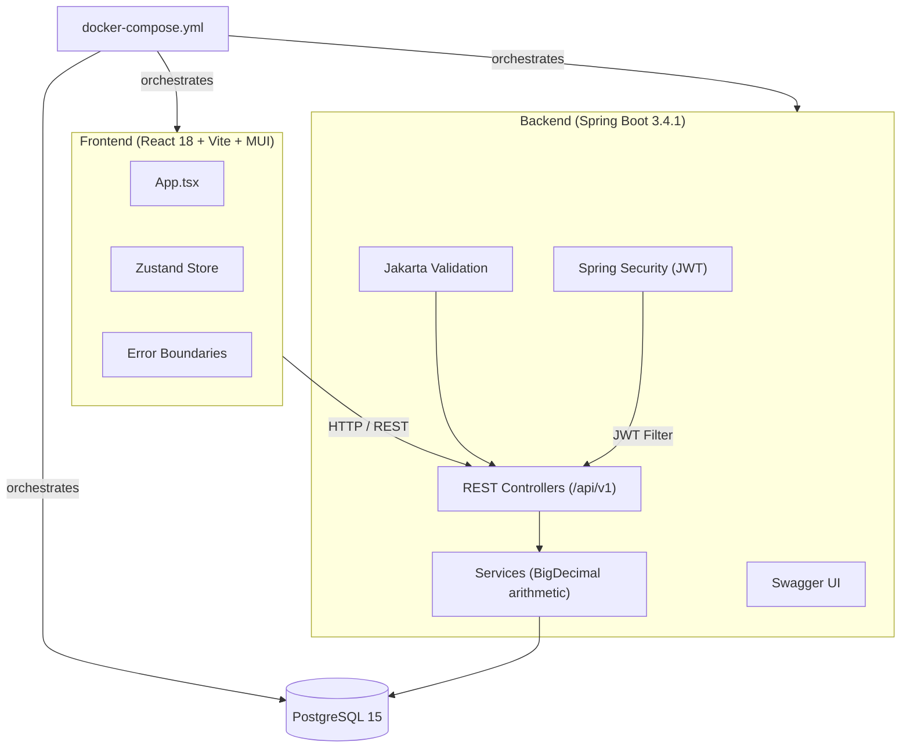

# Gooder Budget

An envelope budgeting application that helps users manage finances by allocating money into categorized envelopes, tracking spending, and transferring funds between budgets.

## Tech Stack

| Layer    | Technology                                        |
| -------- | ------------------------------------------------- |
| Backend  | Spring Boot 3.4.1, Java 17, Spring Security (JWT) |
| Frontend | React 18, TypeScript, Vite, MUI 6, Zustand        |
| Database | PostgreSQL 15                                     |
| DevOps   | Docker, Docker Compose, Nginx                     |
| Docs     | springdoc-openapi (Swagger UI)                    |

## Prerequisites

- Java 17
- Node.js 18+
- Docker & Docker Compose

## Quick Start

```bash
docker-compose up --build
```

This starts three services:

| Service  | URL                   |
| -------- | --------------------- |
| Frontend | http://localhost:3000 |
| Backend  | http://localhost:8080 |
| Postgres | localhost:5432        |

## Manual Setup

### Backend

```bash
cd backend

# Set required environment variables
export DB_URL=jdbc:postgresql://localhost:5432/project2
export DB_USERNAME=postgres
export DB_PASSWORD=password
export JWT_PRIVATE_KEY=your-secret-key
export CORS_ALLOWED_ORIGINS=http://localhost:5173

./mvnw spring-boot:run
```

### Frontend

```bash
cd frontend
npm install
npm run dev
```

The dev server starts at http://localhost:5173 by default.

## Running Tests

### Backend

```bash
cd backend
./mvnw verify
```

This runs all unit and integration tests and generates a JaCoCo coverage report at `backend/target/site/jacoco/index.html`.

### Frontend

```bash
cd frontend
npm run lint
```

## Default Accounts

| Username | Password | Role     |
| -------- | -------- | -------- |
| admin    | password | Manager  |
| user     | password | Employee |

## API Documentation

When the backend is running, Swagger UI is available at:

```
http://localhost:8080/api/v1/swagger-ui
```

OpenAPI JSON spec:

```
http://localhost:8080/api/v1/api-docs
```

## Architecture



## Project Structure

```
├── backend/              Spring Boot application
│   ├── src/main/java/    Java source code
│   ├── src/test/java/    Tests (JUnit 5, Mockito, MockMvc)
│   ├── Dockerfile        Multi-stage build
│   └── pom.xml
├── frontend/             React application
│   ├── src/              TypeScript source code
│   ├── Dockerfile        Multi-stage build (Node → Nginx)
│   └── package.json
├── docker-compose.yml    Full-stack orchestration
└── README.md
```
